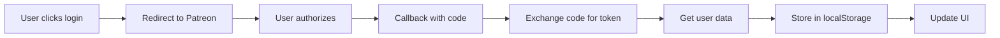

# Patreon Static

A lightweight, open-source JavaScript library for integrating Patreon authentication into static websites. No backend required (except for a Cloudflare Worker).

[](https://opensource.org/licenses/MIT)

## Features

- 🔐 **Secure OAuth 2.0 Flow** - Full Patreon OAuth implementation
- 🚀 **Static Site Ready** - Works with any static site generator (Hugo, Jekyll, etc.)
- 💰 **Membership Detection** - Automatically detect patron status and tiers
- 🚫 **Ad Management** - Automatically hide ads for paying patrons
- 🎨 **Customizable UI** - Easy to style and integrate with your design
- 📱 **Mobile Friendly** - Responsive design that works on all devices
- 🔄 **Persistent Sessions** - Users stay logged in across visits
- 🛡️ **Privacy Focused** - No tracking, minimal data storage

## Quick Start

### 1. Deploy the Cloudflare Worker

```bash
# Clone the repository
git clone https://github.com/korben00/patreon-static.git
cd patreon-static/cloudflare-worker

# Install wrangler CLI
npm install -g wrangler

# Configure and deploy
wrangler login
wrangler deploy
```

### 2. Add to Your Website

```html
<!-- Add CSS -->
<link rel="stylesheet" href="https://cdn.jsdelivr.net/gh/korben00/patreon-static@latest/client/patreon-static.css">

<!-- Add JavaScript -->
<script src="https://cdn.jsdelivr.net/gh/korben00/patreon-static@latest/client/patreon-static.js"></script>

<!-- Initialize -->
<script>
  const patreonStatic = new PatreonStatic({
    workerUrl: 'https://your-worker.workers.dev',
    clientId: 'your-patreon-client-id',
    campaignId: 'your-campaign-id',
    creatorId: 'your-creator-id'
  });
</script>

<!-- Add login button -->
<button data-patreon-login>Login with Patreon</button>
```

### 3. Add Callback Page

Create a `/patreon-callback.html` page on your site (or copy from `client/patreon-callback.html`).

## Documentation

- [Complete Setup Guide](docs/setup-guide.md)
- [Configuration Options](docs/configuration.md)
- [API Reference](docs/api-reference.md)
- [Security Best Practices](docs/security.md)
- [Troubleshooting Guide](docs/troubleshooting.md)

## Examples

Check out the [examples](examples/) directory for complete implementations:

- [Basic HTML](examples/basic-html/) - Simple static HTML site
- [Hugo](examples/hugo/) - Hugo static site generator
- [Jekyll](examples/jekyll/) - Jekyll implementation
- [React](examples/react/) - React single-page application

## How It Works



1. **User clicks login button** - Initiates OAuth flow
2. **Redirect to Patreon** - User authorizes your application
3. **Return with auth code** - Patreon redirects back with authorization code
4. **Token exchange** - Worker exchanges code for access token
5. **Fetch user data** - Worker retrieves user info and membership status
6. **Store locally** - Data saved in browser localStorage
7. **Update UI** - Show user info, hide ads for patrons

## Configuration Options

```javascript
const patreonStatic = new PatreonStatic({
  // Required
  workerUrl: 'https://your-worker.workers.dev',
  clientId: 'your-patreon-client-id',
  
  // Optional
  campaignId: 'your-campaign-id',
  creatorId: 'your-creator-id',
  redirectUri: window.location.origin + '/patreon-callback',
  storageKey: 'patreon_auth',
  loginButtonSelector: '[data-patreon-login]',
  autoRemoveAds: true,
  adSelectors: ['.ad', '.advertisement'],
  debug: false,
  
  // Callbacks
  onLogin: (userData) => console.log('User logged in:', userData),
  onLogout: () => console.log('User logged out'),
  onError: (error) => console.error('Error:', error)
});
```

## API Methods

```javascript
// Programmatic login/logout
patreonStatic.login();
patreonStatic.logout();

// Check authentication status
if (patreonStatic.isAuthenticated()) {
  console.log('User is logged in');
}

// Check if paying member
if (patreonStatic.isPayingMember()) {
  console.log('User is a paying patron');
}

// Get user data
const userData = patreonStatic.userData;
console.log(userData.user.full_name);
console.log(userData.membership_type);
```

## Membership Types

The library detects these membership types:

- `creator` - The campaign creator
- `active_patron` - Currently paying patron
- `declined_patron` - Payment declined
- `former_patron` - Cancelled membership  
- `free_member` - Following but not paying
- `none` - No membership

## Browser Support

- Chrome/Edge 80+
- Firefox 75+
- Safari 13+
- Mobile browsers (iOS Safari, Chrome Android)

## Security Considerations

1. **Always use HTTPS** for your website and callback URLs
2. **Configure CORS** properly in the worker (`ALLOWED_ORIGINS`)
3. **Keep secrets secure** - Never expose client secret in frontend code
4. **Validate state parameter** to prevent CSRF attacks
5. **Token expiration** - Tokens are automatically refreshed

## Contributing

Contributions are welcome! Please read our [Contributing Guide](CONTRIBUTING.md) for details.

1. Fork the repository
2. Create your feature branch (`git checkout -b feature/amazing-feature`)
3. Commit your changes (`git commit -m 'Add amazing feature'`)
4. Push to the branch (`git push origin feature/amazing-feature`)
5. Open a Pull Request

## License

This project is licensed under the MIT License - see the [LICENSE](LICENSE) file for details.

## Author

Created by [Korben](https://korben.info) - Technology blogger and open source enthusiast.

## Acknowledgments

- Thanks to Patreon for their OAuth API
- Cloudflare Workers for serverless hosting
- All contributors and users of this library

## Support

- 📧 Email: korben@korben.info
- 🐛 Issues: [GitHub Issues](https://github.com/korben00/patreon-static/issues)
- 💬 Discussions: [GitHub Discussions](https://github.com/korben00/patreon-static/discussions)

---

Made with ❤️ for the Patreon community